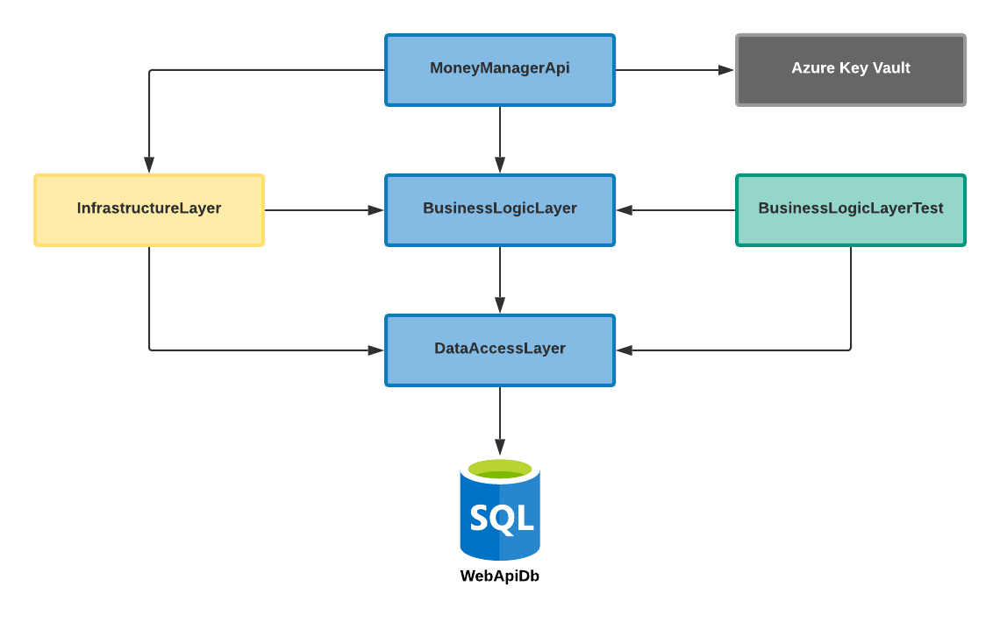

# 💰 Money manager
A simple RESTful API with Blazor client side UI for a personal finance management.
#### Features:
* Multiple wallets
* Hierarchical categories
* Various types of reports
* Adaptive and responsive design
* Localization 
## Prerequisites
.NET Core SDK 3.1
## Tech Stack
ASP.NET Core Web API, SQL Server, Blazor (Server), HTML 5, CSS 3.0, SASS
## Usage
1. Run `configuration.bat` to initialize secret manager (you need to run this only once)
2. Run `start.bat` to build and run API and UI simultaneously or you can run `start api.bat` to use API only 
## Documentation
You can find more information about the API in the [documentation](https://documenter.getpostman.com/view/11494427/TVKBYy3n)
## Architecture
The API project is build using 3-Layered architecture. Also, it is configured to use Azure Key Vault. To use the vault you must provide valid Azure Key Vault properties in a `appsettings.json` file. A big picture of the project is shown below:

